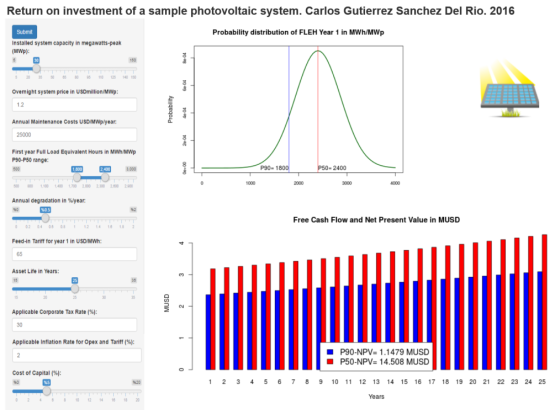

A novel ShinyApp for evaluating the return on investment of a PV Plant
========================================================
author: Carlos Gutierrez Sanchez Del Rio  
date: 2016-08-10
autosize: true

Motivation
========================================================
This App makes it very simple to visualise both the expected cash flows and the return on investment of a utility-sized Photovoltaic Plant, and to explore how the different variables affect the output.

You can easily adjust both the technical data of the plant and the economics, and you get the following ouputs of the App:
  * Visualisation of the probability distribution of the Full Load eq. Hours
  * Free Cash Flows generated by the Plant (excluding Capex and Debt Service)
  * Net Present Value of the investment, both for base case (P50) and worst-case scenarios (P90)

The App: how to get there
========================================================

Please follow the link to: <https://carlosgutierrezsanchezdelrio.shinyapps.io/DDP_ShinyApp/>

This is how it should look:




Using the App
========================================================
To use the App, adjust the plant values and press **Submit**:

- Technical Data :
  * Installed Capacity
  * First Year Full load eq. hours, both P50 and P90 (prob. of exceeding the value of 90%)
  * Degradation of production
  * Asset life
- Economics :
  * Investment and maintenance costs
  * Feed-in  Tariff and inflation
  * Corporate Tax Rate and Cost of Capital

Where to get the data for the model
========================================================
In order to make use of the App you need reliable input data. Luckily, there are several sites that provide you with very reliable solar data:  

* USA: <http://pvwatts.nrel.gov/>
* Europe: <http://re.jrc.ec.europa.eu/pvgis/>
* World: <http://irena.masdar.ac.ae/>

And if you also need investment and maintenance cost data:

IRENA: <http://costing.irena.org/technology-costs/power-generation.aspx>

Annex 
========================================================
**What do the P50 and P90 FLEH values mean?**

<font size="5.5">
The Full Load Equivalent Hours measure the production of a PV plant per unit of installed capacity.

For example, a PV plant with 10 MWp of capacity and FLEH of 1.800 MWh/MWp would generate 18.000 MWh on the first year (then you apply degradation to the generation).

Given the uncertainty of natural resources, it is customary to model the available resource as a normal distribution, and to model the plant for the base case (P50) and the worst case (P90). Sometimes the P75 or other percentile is used.

To get the mean and standard deviation of the normal distribution from the P50&P90 values you need to:

```r
P50<-2200
P90<-1800
meanFLEH<-P50
sdFLEH<-(P50-P90)/qnorm(0.9)
```
For example, for a P50 of **2.200** and a P90 of **1.800** the mean is 2200 and the standard deviation is 312 </font>
